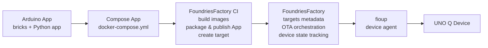

# Detect Objects on Camera

This project demonstrates how to convert an [Arduino App](https://docs.arduino.cc/software/app-lab/apps/about-apps) into a [Compose App](https://www.compose-spec.io/) that can be packaged, distributed, and updated using
[composectl](https://github.com/foundriesio/composeapp),
[fioup](https://github.com/foundriesio/fioup),
and [FoundriesFactory](https://docs.foundries.io/96/getting-started/index.html).

The project is based on the Arduino
[video-generic-object-detection example](https://github.com/arduino/app-bricks-examples/tree/0.8.1/examples/video-generic-object-detection)

The commits in this branch intentionally represent the individual
steps required to convert the original Arduino App into a Compose
App. Reviewing the commit history provides a step-by-step walkthrough
of the conversion process.

## Overview

Arduino Apps are multi-component applications designed for
dual-processor Arduino boards such as the UNO Q.

At runtime, `arduino-app-cli` translates an Arduino App into a
Compose-based application and starts it using Docker Compose.

This repository makes that Compose representation explicit and
self-contained by:

- building the main Python application into a container image,
- defining the application using `docker-compose.yml`,
- packaging the application as a Compose App.

As a result, the application can be:

- versioned and distributed as a Compose App,
- deployed and updated using `fioup`,
- managed through FoundriesFactory.



## Project Structure

```bash
tree -aL2 -I .git
.
├── app
│   ├── app.yaml
│   ├── assets
│   ├── python
│   └── README.md
├── .composeappignores
├── docker-compose.yml
├── Dockerfile
├── install.sh
├── LICENSE
├── models
│   └── model.eim
└── README.md

```

## Components

### `app/`

Contains the original Arduino App source code copied from the
[Arduino example repository](https://github.com/arduino/app-bricks-examples/tree/0.8.1/examples/video-generic-object-detection).

### `Dockerfile`

Builds the container image for the main Python application service.

The image is based on:

```text
ghcr.io/arduino/app-bricks/python-apps-base:0.9.0
```

During the build process, `install.sh` installs all Python
dependencies required by the application.

### `docker-compose.yml`

Defines the Compose App.

The `ei-video-obj-detection-runner` service definition is derived
from the [Arduino brick Compose definition](https://github.com/arduino/app-bricks-py/blob/release/0.9.0/src/arduino/app_bricks/video_objectdetection/brick_compose.yaml)

The `main` service definition mirrors the Compose configuration
generated dynamically by `arduino-app-cli`.

### `.composeappignores`

Controls which files are included in the Compose App bundle
produced by `composectl publish`.

Only `docker-compose.yml` is included in the final Compose App
bundle, since the rest of the App content is packaged 
into container images.

### `models/`

Contains ML model artifacts packaged as part of the Compose App bundle and used by the `video_object_detection` service at runtime.

## Deploy with FoundriesFactory

### Prerequisites

Before deploying and managing the Compose App with FoundriesFactory:

1. create a container-only FoundriesFactory,
2. install `fioup` on the target UNO Q device(s),
3. register the device(s) with the factory.

See:

- https://docs.foundries.io/96/getting-started/gs-container-only.html#ref-gs-container-only
- https://github.com/foundriesio/fioup/blob/main/docs/install.md
- https://github.com/foundriesio/fioup/blob/main/docs/register-device.md

### Add the App to `containers.git`

The example can be added to a factory’s `containers.git`
repository as a Git submodule:

```bash
# from the root of your factory's containers.git
git submodule add -b arduino-apps/video-generic-object-detection https://github.com/foundriesio/containers video-obj-detect
```

After committing and pushing the changes to `containers.git`,
FoundriesFactory automatically builds the App images,
packages the Compose App, publishes it, and creates a deployable target.

Devices can discover and apply updates using:

```bash
sudo fioup check
sudo fioup update
```

Alternatively, `fioup` can run as a daemon and automatically apply
updates as they become available.

```bash
sudo systemctl enable fioup
sudo systemctl start fioup
```

See also:

- https://docs.foundries.io/96/user-guide/containers-and-docker/containers.html
- https://github.com/foundriesio/fioup
